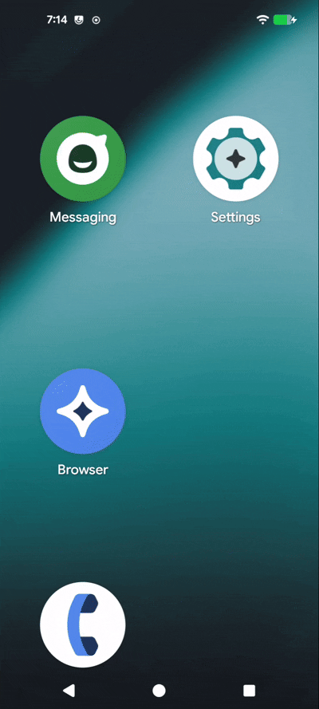

## App Drawer Access
I worked on these edits over a few weeks using various AI tools to vibe code improvements to Trebuchet the [LineageOS](https://lineageos.org/) Launcher. I had not touched java since undergrad object-oriented programming course (possibly some 16 yrs ago now) so this would have been a much more involved process without AI tools for me.  This project has two main feature goals:
1. Option to disable swipe up to access the app drawer.
2. Ability to add a short cut to allow for tap access to the app drawer.

### Why & Motivation 
I have multiple elder folks in my family who use smart phones and struggle with using them due to age related disabilities such as neuropathy and dementia. They also have various challenges with vision and hearing which accessibility options in phone typically only target. Neuropathy can mean loss of feeling which can make it hard or impossible to do swipe gestures properly. This can lead to either not being able to do swipe only tasks or doing a different swipe gesture than you intend. App drawer access has largely been moved to swipe only action on most phones. These edits are aimed at bringing back the option to configure tap access to the app drawer. I have looked for a phone that I can buy with these features, but have yet to really find one so I opted to do these updates to the opensource LineageOS and use older phones that fit the hardware needs. 

### Implementation
Two approaches were taken to make these user configurable options. 
1. The option of disabling swipe up access was added to the Home Settings menu which can be accessed by a long press on the desktop. This can be set independently of the presence of the app drawer icon.
2. A shortcut can be added from the widget picker. The widget picker can be accessed from a long press on the desktop. This can be placed in the favorites / hotseat or on a desktop grid. It can be placed independently of the swipe access being on or off.

Because both are independent you can have any combination of these settings or placements active. I have found it useful to lock the desktop, disable swipe access to the app drawer, and not have an apps icon present to allow for limiting phone functional options for example only place key contacts or apps on the desktop. Locking the desktop mitigates swipes that accidentally delete icons and simplifying the phone to key icons can help keep the phone functional (not confusing) for some. 

All edits are in the "allapps-shortcut-fix" branch and not the branch that this readme and its media / files are in. 

### Demo Loop
A gif animation showing the ability to do each of the tasks mentioned. 

### Build Notes
This was built on Linux Mint 22.3 using [Goose Desktop](https://goose-docs.ai/) (duck.ai, Gemma, gpt-5.4-mini, and [ollama](https://ollama.com/) w/ mistral-small). I used VScode and xed for editors. Testing was done with a Moto G Power 2021 ([borneo](https://wiki.lineageos.org/devices/borneo/)) and LineageOS 23.2. 

#### Build Machine
I was seeing build times for full Lineage 23.2 coming 8.5 to 12 hours depending on edits I was trying and whether I had other stuff running on the system. At times I was having to close Goose Desktop, VScode and kill java to free up ram as the build process could use in the low 40 GB of memory. 
- CPU = X58 era Intel Xeon W3690
- RAM = 48 GB DDR3
- GPU = GTX 1060 6GB
- Drive = 1TB SATA SSD
